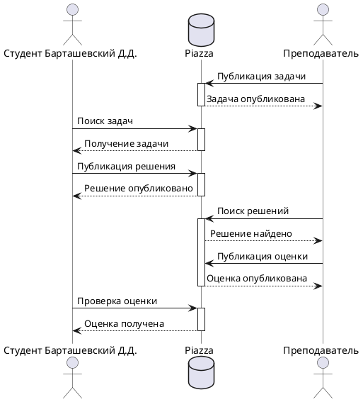

# Задача 1
### Формулировка задачи
Реализовать с помощью математического языка LaTeX нижеприведенную формулу:

Прислать код на LaTeX и картинку-результат, где, помимо формулы, будет указано ФИО студента.
### Решение
```latex
\documentclass{article}
\usepackage{amsmath}

\begin{document}

\begin{equation*}
\int_{x}^{\infty} \frac{dt}{t(t^2 - 1) \log t} = \int_{x}^{\infty} \frac{1}{t \log t} \left( \sum_{m} t^{-2m} \right) dt = \sum_{m} \int_{x}^{\infty} \frac{t^{-2m}}{t \log t} \, dt \overset{(u = t^{-2m})}{=} - \sum_{m} \operatorname{li}(x^{-2m})
\end{equation*}

\vspace{1cm}

Барташевский Дмитрий Дмитриевич

\end{document}
```


# Задача 2
### Формулировка задачи
На языке PlantUML реализовать диаграмму на рисунке ниже. Прислать текст на PlantUML и картинку-результат, в которой ФИО студента заменены Вашими собственными. Обратите внимание на оформление, желательно придерживаться именно его, то есть без стандартного желтого цвета и проч. Чтобы много не писать используйте псевдонимы с помощью ключевого слова "as".

Используйте [онлайн-редактор](https://plantuml-editor.kkeisuke.com/).
### Решение


