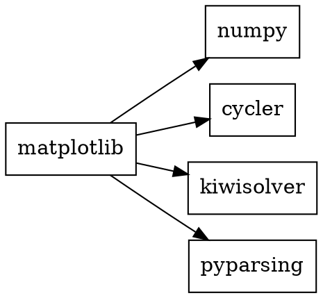
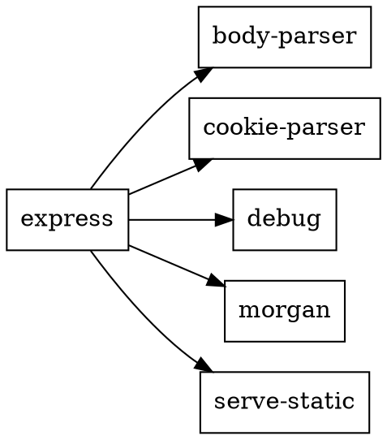

# Задача 1
### Формулировка задачи
Вывести служебную информацию о пакете matplotlib (Python). Разобрать основные элементы содержимого файла со служебной информацией из пакета.
### Решение
```
pip show matplotlib
```


#### Основные элементы содержимого файла со служебной информацией из пакета:
* Name: matplotlib (имя пакета)
* Version: 3.9.2 (версия пакета по стандарту семантического версионирования (SemVer). В данном случае 3.9.2 указывает на третью основную версию (MAJOR — 3), с девятым минорным обновлением (MINOR — 9), а патч (PATCH — 2) включает исправления ошибок без изменения функциональности)
* Summary: Python plotting package (краткое описание пакета. В этом случае пакет matplotlib — это библиотека для построения графиков в Python)
* Home-page: https://matplotlib.org (ссылка на официальный сайт или документацию пакета)
* Author: John D. Hunter, Michael Droettboom (авторы пакета)
* Author-email: Unknown matplotlib-users@python.org (контактная информация автора)
* License: License agreement for matplotlib versions 1.3.0 and later (лицензия, по которой распространяется пакет)
### Формулировка задачи
Как получить пакет без менеджера пакетов, прямо из репозитория?
### Решение
Чтобы скачать и установить пакет без использования менеджера пакетов, можно получить его исходный код напрямую из репозитория, например, с GitHub.
```
git clone https://github.com/matplotlib/matplotlib.git
cd matplotlib
pip install .
```


# Задача 2
### Формулировка задачи
Вывести служебную информацию о пакете express (JavaScript). Разобрать основные элементы содержимого файла со служебной информацией из пакета. Как получить пакет без менеджера пакетов, прямо из репозитория?
### Решение
```
npm view express
```


#### Основные элементы содержимого файла со служебной информацией из пакета:
* express (имя пакета)
* 4.21.0 (Версия пакета по стандарту семантического версионирования (SemVer). В данном случае 4.21.0 указывает на четвёртую основную версию (MAJOR — 4), с двадцать первым минорным обновлением (MINOR — 9), а патч (PATCH — 0) включает исправления ошибок без изменения функциональности)
* MIT (лицензия, по которой распространяется пакет (в данном случае MIT, одна из самых открытых лицензий)
* deps: 31 (количество зависимостей. Пакет Express требует 31 внешнюю библиотеку для работы)
* versions: 279 (количество опубликованных версий Express.js)
* Fast, unopinionated, minimalist web framework (краткое описание пакета: Express — это быстрый, минималистичный веб-фреймворк для Node.js)
* http://expressjs.com/ (ссылка на официальный сайт, где можно найти документацию и другие ресурсы, связанные с пакетом)
* keywords: express, framework, sinatra, web, http, rest, restful, router, app, api (список ключевых слов, по которым можно найти пакет)
* dist (информация о дистрибуции пакета)
  * .tarball: https://registry.npmjs.org/express/-/express-4.21.0.tgz (ссылка на архив пакета в формате .tgz, который можно скачать)
  * .shasum: d57cb706d49623d4ac27833f1cbc466b668eb915 (контрольная сумма (SHA-1) для проверки целостности пакета)
  * .integrity: sha512-VqcNGcj/Id5ZT1LZ/cfihi3ttTn+NJmkli2eZADigjq29qTlWi/hAQ43t/VLPq8+UX06FCEx3ByOYet6ZFblng== (контрольная сумма по алгоритму SHA-512 для подтверждения целостности)
  * .unpackedSize: 220.8 kB (размер распакованного пакета)
* dependencies (список зависимостей пакета и их версии)
* maintainers (список мейнтейнеров пакета и их контактные данные)
* dist-tags (теги дистрибуции)
  * latest: 4.21.0 (стабильная версия пакета)
  * next: 5.0.0 (следующая версия, которая еще не является стабильной)
### Формулировка задачи
Как получить пакет без менеджера пакетов, прямо из репозитория?
### Решение
Чтобы скачать и установить пакет без использования менеджера пакетов, можно получить его исходный код напрямую из репозитория, например, с GitHub.
```
git clone https://github.com/expressjs/express.git
cd express
npm install
```


# Задача 3
### Формулировка задачи
Сформировать graphviz-код и получить изображения зависимостей matplotlib и express.
### Решение
Создадим .dot файл для зависимостей matplotlib:



Создадим .dot файл для зависимостей express:



# Задача 4
### Формулировка задачи
Следующие задачи можно решать с помощью инструментов на выбор:

Решатель задачи удовлетворения ограничениям (MiniZinc).
SAT-решатель (MiniSAT).
SMT-решатель (Z3).
Изучить основы программирования в ограничениях. Установить MiniZinc, разобраться с основами его синтаксиса и работы в IDE.

Решить на MiniZinc задачу о счастливых билетах. Добавить ограничение на то, что все цифры билета должны быть различными (подсказка: используйте all_different). Найти минимальное решение для суммы 3 цифр.
### Решение
```MiniZinc
include "alldifferent.mzn";

% Массив цифр билета
array[1..6] of var 0..9: digits;

% Ограничение на то, что все цифры различны
constraint all_different(digits);

% Ограничение на счастливый билет: сумма первых 3 цифр равна сумме последних 3
constraint digits[1] + digits[2] + digits[3] = digits[4] + digits[5] + digits[6];

% Ограничение для поиска минимального возможного решения
solve minimize digits[1] * 100000 + digits[2] * 10000 + digits[3] * 1000 + digits[4] * 100 + digits[5] * 10 + digits[6];
```
### Ответ


# Задача 5
### Формулировка задачи
Решить на MiniZinc задачу о зависимостях пакетов для рисунка, приведенного ниже.


### Решение
```MiniZinc
% Множество доступных версий для каждого пакета
set of int: MenuVersions = 1..6;
set of int: DropdownVersions = 1..5;
set of int: IconsVersions = 1..2;

% Переменные для версии каждого пакета
var MenuVersions: menu_version;
var DropdownVersions: dropdown_version;
var IconsVersions: icons_version;

% Зависимости между версиями
% Зависимости пакета menu
constraint
  (menu_version == 6 -> dropdown_version == 5) /\
  (menu_version == 6 -> dropdown_version == 4) /\
  (menu_version == 6 -> dropdown_version == 3) /\
  (menu_version == 6 -> dropdown_version == 2) /\
  (menu_version == 5 -> dropdown_version == 5) /\
  (menu_version == 5 -> dropdown_version == 4) /\
  (menu_version == 5 -> dropdown_version == 3) /\
  (menu_version == 5 -> dropdown_version == 2) /\
  (menu_version == 4 -> dropdown_version == 5) /\
  (menu_version == 4 -> dropdown_version == 4) /\
  (menu_version == 4 -> dropdown_version == 3) /\
  (menu_version == 4 -> dropdown_version == 2) /\
  (menu_version == 3 -> dropdown_version == 5) /\
  (menu_version == 3 -> dropdown_version == 4) /\
  (menu_version == 3 -> dropdown_version == 3) /\
  (menu_version == 3 -> dropdown_version == 2) /\
  (menu_version == 2 -> dropdown_version == 5) /\
  (menu_version == 2 -> dropdown_version == 4) /\
  (menu_version == 2 -> dropdown_version == 3) /\
  (menu_version == 2 -> dropdown_version == 2) /\
  (menu_version == 1 -> dropdown_version == 1);

% Зависимости пакета dropdown
constraint
  (dropdown_version == 5 -> icons_version == 2) /\
  (dropdown_version == 4 -> icons_version == 2) /\
  (dropdown_version == 3 -> icons_version == 2) /\
  (dropdown_version == 2 -> icons_version == 2);

% Вывод
solve satisfy;

output ["Menu version: \(menu_version)\n", "Dropdown version: \(dropdown_version)\n", "Icons version: \(icons_version)\n"];
```
### Ответ


# Задача 6
### Формулировка задачи
Решить на MiniZinc задачу о зависимостях пакетов для следующих данных:
```
root 1.0.0 зависит от foo ^1.0.0 и target ^2.0.0.
foo 1.1.0 зависит от left ^1.0.0 и right ^1.0.0.
foo 1.0.0 не имеет зависимостей.
left 1.0.0 зависит от shared >=1.0.0.
right 1.0.0 зависит от shared <2.0.0.
shared 2.0.0 не имеет зависимостей.
shared 1.0.0 зависит от target ^1.0.0.
target 2.0.0 и 1.0.0 не имеют зависимостей.
```

### Решение
```MiniZinc
% Определяем количество версий для каждого пакета
int: num_foo = 2;         % foo имеет 2 версии: 1.0.0 и 1.1.0
int: num_left = 1;        % left имеет 1 версию: 1.0.0
int: num_right = 1;       % right имеет 1 версию: 1.0.0
int: num_shared = 2;      % shared имеет 2 версии: 1.0.0 и 2.0.0
int: num_target = 2;      % target имеет 2 версии: 1.0.0 и 2.0.0

set of int: VersionsFoo = 1..num_foo;
set of int: VersionsLeft = 1..num_left;
set of int: VersionsRight = 1..num_right;
set of int: VersionsShared = 1..num_shared;
set of int: VersionsTarget = 1..num_target;

% Переменные для хранения выбранной версии каждого пакета
var VersionsFoo: foo_version;
var VersionsLeft: left_version;
var VersionsRight: right_version;
var VersionsShared: shared_version;
var VersionsTarget: target_version;

% Задаем зависимости между пакетами

% root 1.0.0 зависит от foo ^1.0.0 и target ^2.0.0
constraint foo_version >= 1 /\ target_version == 2;

% foo 1.1.0 зависит от left ^1.0.0 и right ^1.0.0
constraint 
    (foo_version == 2 -> left_version == 1 /\ right_version == 1);

% left 1.0.0 зависит от shared >=1.0.0
constraint 
    (left_version == 1 -> shared_version >= 1);

% right 1.0.0 зависит от shared <2.0.0
constraint 
    (right_version == 1 -> shared_version < 2);

% shared 1.0.0 зависит от target ^1.0.0
constraint 
    (shared_version == 1 -> target_version >= 1);

% Оптимизация: выбираем наиболее новые версии пакетов
solve satisfy;
```
### Ответ

